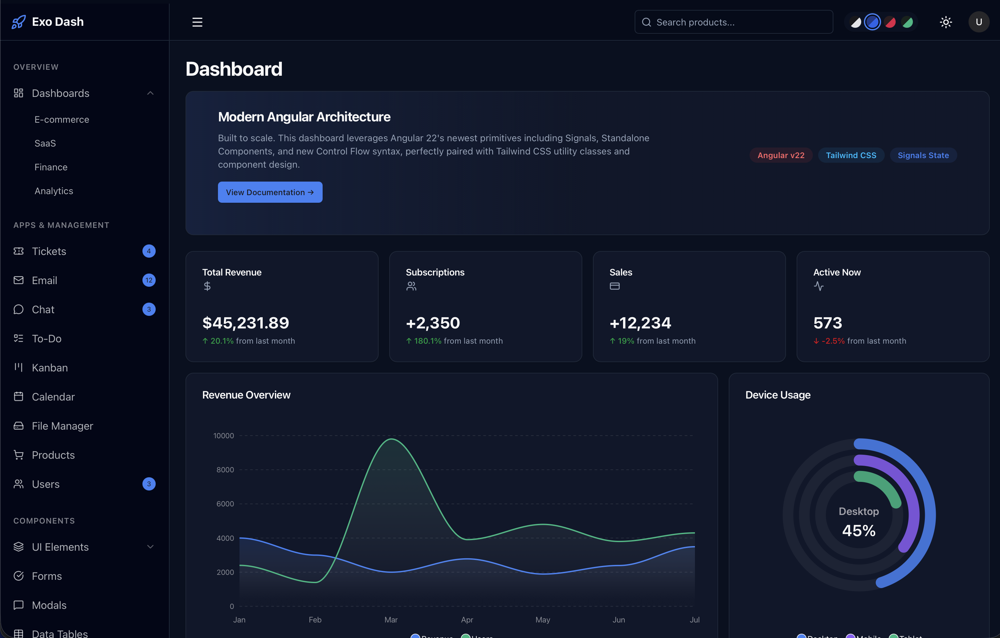

# Exo UI - Angular Dashboard Template



Welcome to **Exo UI**, a premium, beautifully crafted Angular dashboard template designed with developer experience in mind. It leverages the latest Angular features (Standalone Components, Signals, Functional Routing) alongside Tailwind CSS v4 for ultimate customizability.

📚 **[View the Official Documentation](https://exoui.dev/documentation)**

## 🚀 Setup Guide (Angular)

### 1. Prerequisites
Before you begin, ensure you have the following installed on your local machine:
- **Node.js**: `v18.13.0` or higher (we recommend using the latest LTS version).
- **npm** or **yarn** package manager.
- **Angular CLI**: Ensure you have the latest Angular CLI installed globally.
  ```bash
  npm install -g @angular/cli
  ```

### 2. Installation
To get started with the Exo UI template, navigate to your project folder and install the dependencies:

```bash
# Navigate to the project root
cd exo-dash-angular

# Install NPM dependencies
npm install 
```

### 3. Running the Development Server
Exo UI comes pre-configured with a highly optimized Vite-based development server. To start local development:

```bash
npm start
# or natively via CLI:
# ng serve
```

Once the server has spun up, open your browser and navigate to:
**`http://localhost:4200/`**

The application features hot-module replacement (HMR), so it will automatically update in the browser whenever you modify source files.

### 4. Building for Production
When you're ready to deploy your application to a live server, run the production build command:

```bash
npm run build
# or natively via CLI:
# ng build
```

This compiles the project ahead-of-time (AOT) and stores the minified, highly optimized build artifacts in the `dist/` directory.

### 5. Running Tests
Exo UI is configured to use **Vitest** for incredibly fast component and unit testing out of the box.

```bash
npm run test
# or natively via CLI:
# ng test
```

To scaffold out new components anywhere in your project quickly, the Angular CLI contains built-in generators:
```bash
ng generate component feature-name
```
For a complete list of available schematics, run `ng generate --help`.

---

## 📂 Directory Architecture Breakdown

Here is a breakdown of the project layout, defining where pages, components, and application state live:

- **`src/app/features/` (Pages)**: This is where all the main application pages (e.g., dashboard, analytics, settings) reside. Each directory contains a lazy-loaded route and its scoped configurations.
- **`src/app/shared/components/` (Components)**: Reusable and presentational UI components (buttons, cards, tables, modals, etc.) shared across various feature modules.
- **`src/app/layout/`**: Contains the broad structural wrappers for the application, such as `app-shell` (the primary dashboard wrapper containing the sidebar and header) and `auth-layout`.
- **`src/app/core/services/` (State)**: Houses application-wide singleton services. This is where central state management, API data-fetching, and shared business logic live (e.g., `theme.service.ts`, `sidebar.service.ts`, `user.service.ts`).

## 🎨 Advanced Theming & Customization

Exo UI features a robust styling engine powered by Tailwind CSS v4 and native CSS variables. This creates a flexible system where updating a few core variables instantly trickles down to hundreds of UI components seamlessly.

### 1. The Design Token Architecture
In `src/styles.css`, you will find `@layer base` defining standard CSS variables under the `:root` selector. These variables map directly to dynamic Tailwind utility classes.
- For example, `--primary: #18181b;` enables you to use classes like `bg-primary`, `text-primary`, or `border-primary` inside your components.
- By tweaking these tokens, you can rapidly adapt the Exo UI template to perfectly match your unique brand identity.

### 2. Managing Dark Mode
Exo UI handles dark mode inverse color styling locally under the `.dark` class block inside `src/styles.css`.
When the HTML `dark` class is appended to the global document root, the variables automatically swap seamlessly:
```css
/* Typical Light Mode Setup */
:root {
  --background: #ffffff;
  --primary: #18181b;
}

/* Matching Dark Mode Setup */
.dark {
  --background: #09090b;
  --primary: #fafafa;
}
```

### 3. Creating Custom Theme Variants
Exo UI ships with four color variants out of the box (`zinc` default, `blue`, `rose`, `green`). 
Creating a new architectural theme is incredibly straightforward. Simply declare a brand new class globally in your stylesheet overriding the core UI tokens you wish to adjust.

```css
/* Custom Purple Theme */
.theme-purple {
  --primary: #9333ea;
  --ring: #9333ea;
}
.theme-purple.dark {
  --primary: #c084fc;
  --ring: #c084fc;
}
```

### 4. Interfacing with ThemeService
Central state management of the UI theme lives in `src/app/core/services/theme.service.ts`. It strictly leverages modern **Angular Signals** to maintain absolute reactive sync with the browser's actual DOM and memory `localStorage`.

```typescript
import { Component, inject } from '@angular/core';
import { ThemeService } from '@core/services/theme.service';

@Component({...})
export class SettingsComponent {
  themeService = inject(ThemeService);

  swapTheme() {
    // Toggles Light/Dark Mode
    this.themeService.toggleTheme();
    
    // Switch to a completely different color scheme palette
    this.themeService.setColorScheme('rose');
  }
}
```

---

## 🏗️ Core Application Guidelines

To ensure your dashboard stays performant and maintainable during large-scale production extensions, we recommend adhering to Exo UI's leading architectural principles below.

### UI Component Sandbox 
- All generic presentational frontend components sit inside `src/app/shared/components/`. 
- Components (such as `<app-card>` or `<app-button>`) rely natively on `@angular/core` **Signal Inputs** (`input<T>()`).
- Always pass variant styles directly to components via the `variant` parameters rather than hard-coding business logic into shared elements.

### Signal Forms API
Exo UI leverages the bleeding-edge Angular Signal forms APIs with `Zod` validation mechanisms for all user input pipelines natively.
- Forms are strongly typed, fully reactive, and incredibly boilerplate-free.
- See `src/app/features/forms/` for live configuration and setup examples of structured profile schemas.

### Functional Standalone Routing
Exo UI relies entirely on modern Angular Standalone Components—meaning absolutely zero legacy `ngModule` overhead.
- Open **`src/app/app.routes.ts`** to view and modify the primary routing tree structure.
- Navigation inside the main portal uses chunk lazy-loading natively. Adding a new module is as simple as inserting a `loadComponent:` object array into the `AppShellComponent` children.
- Application Layouts are segregated securely at the root: the authentication layout wrapper (`AuthLayoutComponent`) operates completely isolated from the standard administrative dashboard environment.
